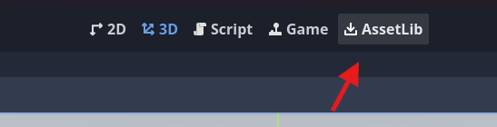
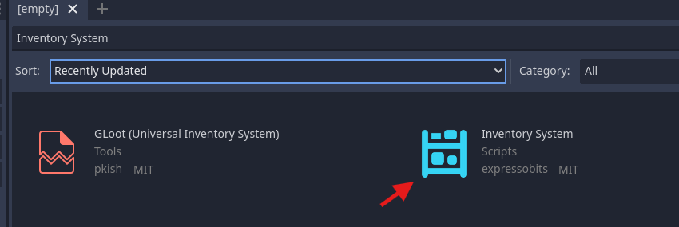
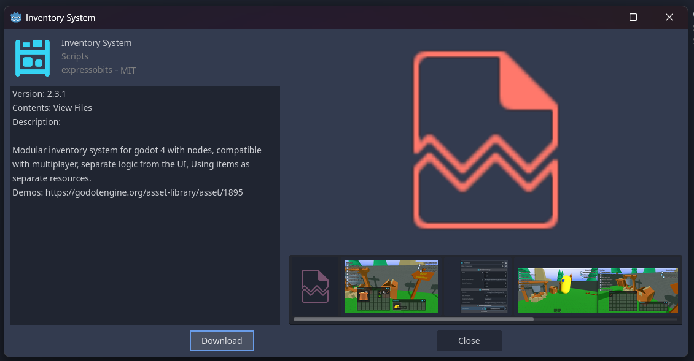
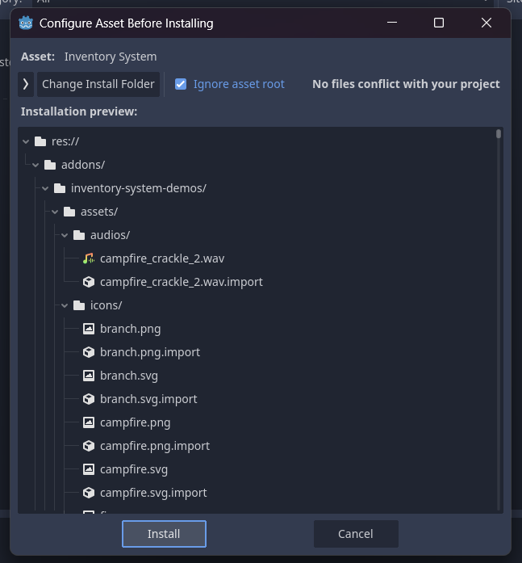
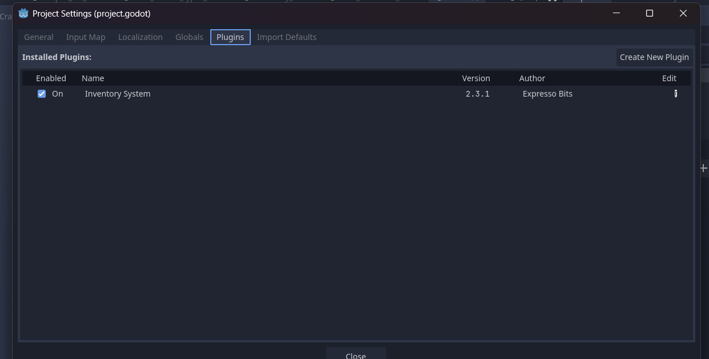

# Installation

## Installing via Godot Asset Lib

Enter in Asset Lib on top view of Godot:



Search for the "Inventory System" plugin



Select Download



Select Install for add addon in your project.



## Install via Git Modules
Open a terminal in your project folder

Type command for add submodule

```bash
git submodule add https://github.com/expressobits/inventory-system.git addons/inventory-system
```

3. Type command for start submodule

```bash
git submodule update --init --recursive
```


## Active Plugin after install

After installing, you may need to restart godot and then activate it in ProjectSettings


