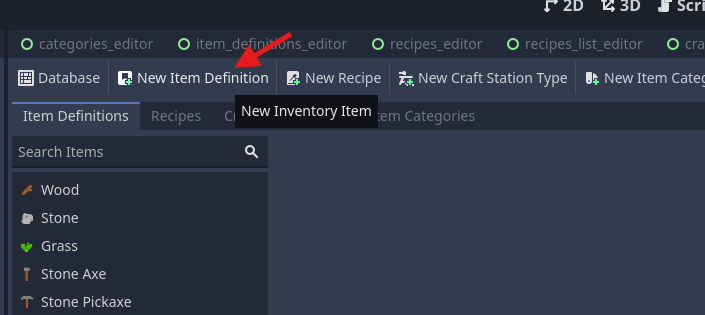
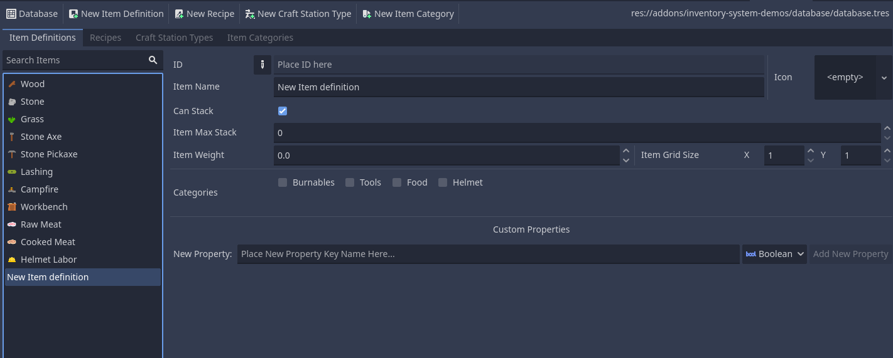

# Create Item Definition

## Creating

To create new items in a database, select the "_**New Item**_" option



If created successfully your editor will update to show the item in the _Item Definitions_ tab


## Setup New Item Definition
Define your item's settings, the most essential ones for this start are id, name and whether your item stacks

- `ID`: String identification of the item, used to get the item based on a list of items easily using the id.
        You can use the button to edit the id correctly, it will indicate in red if the id already exists.

    !!! note annotate Item Definition id easy access

        The base node (NodeInventories) has two methods that use the database field (InventoryDatabase) that use this id to facilitate access to items

        ```gdscript
        # Get id of item
        int get_id_from_item(item: ItemDefinition)

        # Get resource (ItemDefinition) from id param
        ItemDefinition get_item_from_id(id: int)
        ```

- `Icon`: Texture to display your item in-game and in the editor
- `Name`: Name to be displayed or used as additional identification (It is your responsibility to use this field)

