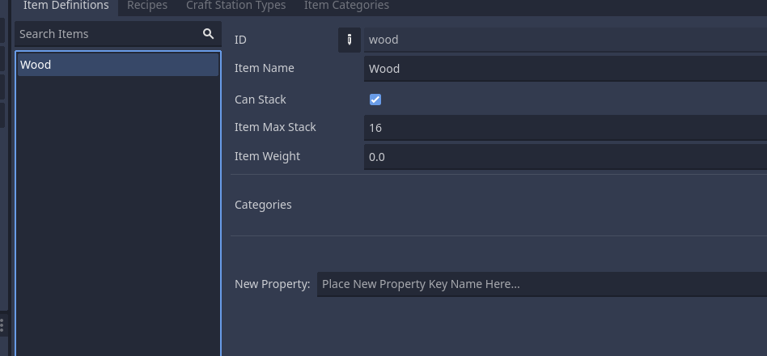

# Create Item Definition

## Creating

To create new items in a database, select the "_**New Item**_" option

If created successfully your editor will update to show the item in the _Item Definitions_ tab

## Setup New Item Definition
Define your item's settings, the most essential ones for this start are id, name and whether your item stacks

See more about item definition on [Item Definition](../../features/item_definition.md).

For this quick start we put a wood with 16 stack, this will be used for the next steps of this guide.

