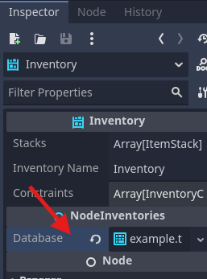
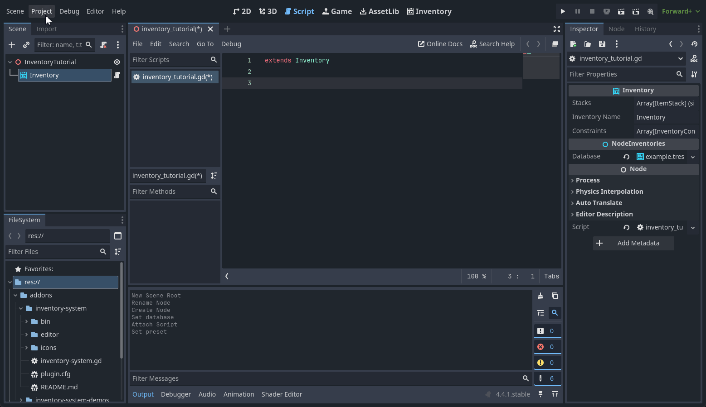

# Add items to Inventory

In this guide we will start to see the nodes of this plugin, the first and most important is the Inventory Node, it is used to store your items.

!!! note annotate "Grid Inventory"

    There is also a [GridInventory](../../features/grid_inventory.md) node in the module that extends the Inventory node, it stores and manages items based on a grid using the grid_size attributes of the item definitions.


## Setup

Let's start with an empty scene


Add an inventory node, the inventory node is the main structure of this addon.

> **Note:** Understanding the basics is important to understand the flexibility of this addon.


After adding the node, it will display a warning indicating that it needs to configure its database.

!!! note annotate "Inventory Database data structure"

    The [InventoryDatabase](../../features/database.md) is where the item structures and their attributes will be saved, important data, for example, an item's identifier, are contained within this resource.

	This tutorial does not cover the database, we will use the database already available in the demo, to understand more about Inventory Database, check the tutorials about it.


Define the database, it should look like this.



In the node inspector, we can see the current inventory stacks, we will use it to view what is available within the inventory. Don't change anything now.

Create a test script on the parent node of the inventory node, it will be used for all our tests from now on.


Let's add keys for interaction in this tutorial, to do this open the top menu "Project" -> "ProjectSettings" -> Access the "InputMap" tab
!!! note annotate "Inventory System Demo Keys"

    It is only necessary to create it if you do not have the inventory-system-demos folder, if it was added, it automatically adds keys to your project.


Add the keys you will need for this guide:

| Key         | Input Name  |
| ----------- | ------------|
| ++e++       | interact    |
| ++f1++      | add_item_a  |

If you don't know how to add it, you can see this guide from the godot documentation:
[Input Examples in Godot Docs](https://docs.godotengine.org/en/latest/tutorials/inputs/input_examples.html)

## Showing inventory items

Let's now show the items in this inventory with a simple command.

Let's create a variable pointing to the inventory, dragging it to the script while holding the ++ctrl++ key.



We added code to display stacks each time we click the configured action "interact" which in the demo is the ++e++ key
```gdscript title="inventory_tutorial.gd" linenums="1"
func _process(delta):
	if Input.is_action_just_pressed("interact"):
		print("Inventory Stacks:")
		for stack in inventory.stacks:
			print("A Stack")
```

The result is this:
```
Inventory Stacks:
A Stack
A Stack
A Stack
A Stack
A Stack
A Stack
A Stack
A Stack
A Stack
A Stack
A Stack
A Stack
A Stack
A Stack
A Stack
A Stack
```

Modify the code now to display when there is an item in the stack, its id and quantity, if not it displays the message "Empty"
```gdscript title="inventory_tutorial.gd" linenums="1"
func _process(delta):
	if Input.is_action_just_pressed("interact"):
		print("Inventory Stacks:")
		for stack in inventory.stacks:
			if stack.item != null:
				print(stack.item_id," x ", stack.amount)
			else:
				print("Empty")
```

## Add Items to Inventory

Let's configure an item to be added, add a variable to link an item to the script, so we can add it to the inventory:
```gdscript title="inventory_tutorial.gd" linenums="1"
...
@onready var inventory = $Inventory

# Add this 👇
@export var item_id : String = "wood"

# Called when the node enters the scene tree for the first time.
func _ready():
...
```

We added code that adds an item each time we click the ++f1++ key
```gdscript title="inventory_tutorial.gd" linenums="1"
			print(stack.item_id," x ", stack.amount)
			else:
				print("Empty")
        # Add this 👇
	if Input.is_action_just_pressed("add_item_a"):
		inventory.add(item_id, 1)
```

Now after typing ++f1++ (key that adds item configured in the demo) and then ++e++ (interaction key configured in the demo), you can see that an item has been added to the inventory.
```
Inventory Stacks:
Wood x 1
Empty
Empty
Empty
Empty
Empty
Empty
Empty
Empty
Empty
Empty
Empty
Empty
Empty
Empty
Empty
```
