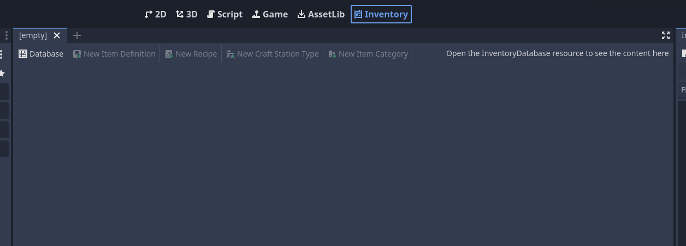
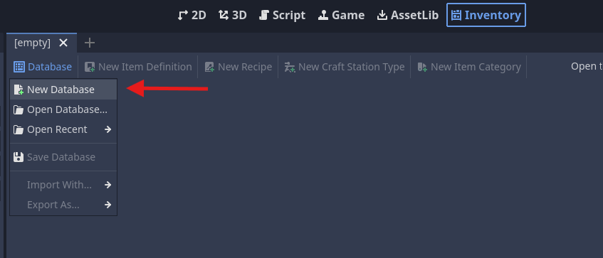

# Creating a `Database`

This guide shows how to create a new database, the demo (inventory-system-demos/base folder) in the addon already contains a database used in fps-demo.
Database is a resource that will manage project-level information about items, recipes, and craft stations. It contains lists of internal resources for each data type. 

!!! note annotate Editor do database

    You can edit it via Godot's own inspector, but we recommend using the plugin's own editor for this.

Go to **Inventory** in top view of godot editor

!!! note warning "Inventory tab does not exist?"

    If the Inventory tab above does not appear, it means that your plugin was not installed correctly or that it was not active in the Project Settings, check the [Instalation](../../installation)

In this part you will see the editor empty, we will add the key file for adding any resource to the inventory system, the Inventory Database.

Select the new database option to open the window to create a new database.

Choose the name of your database and Select **Ok**(Normally a simple project will have no more than one database, that is, a name like 'database' would already be suggested)

Now we can see that the editor screen has changed, showing 4 icons available in the editor, to add a new item, recipe, craft-station and category respectively.

